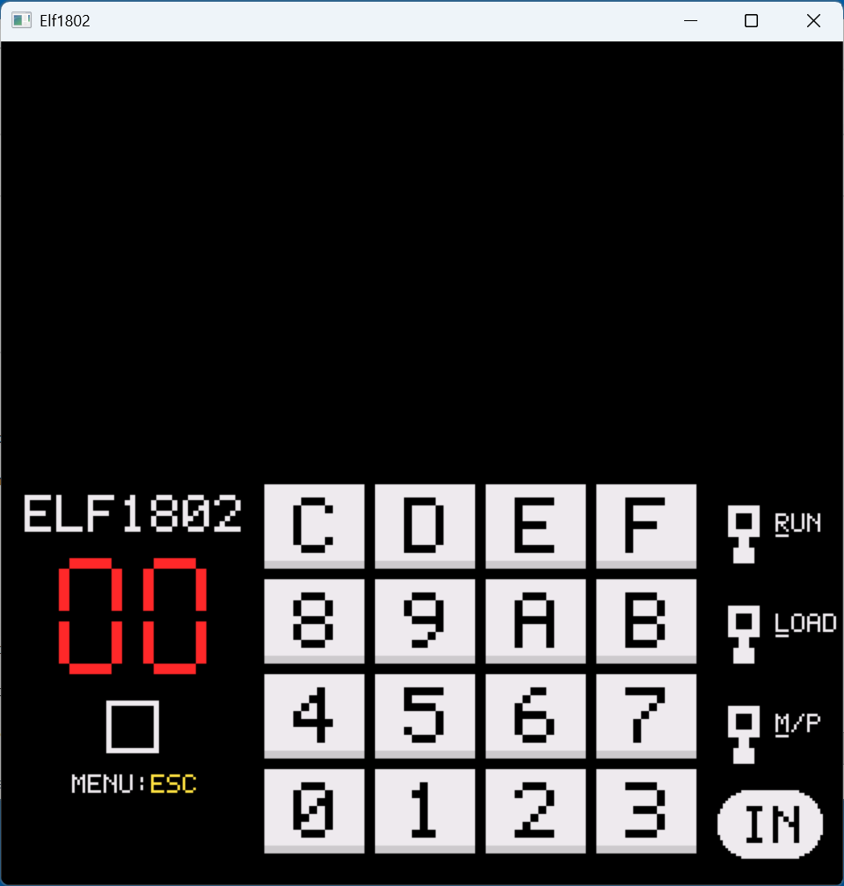
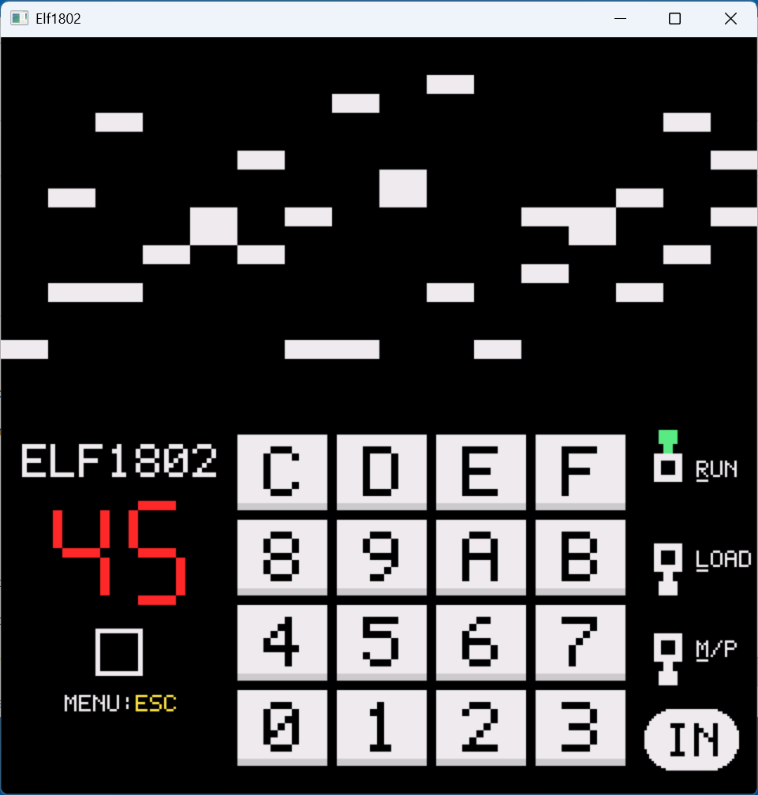
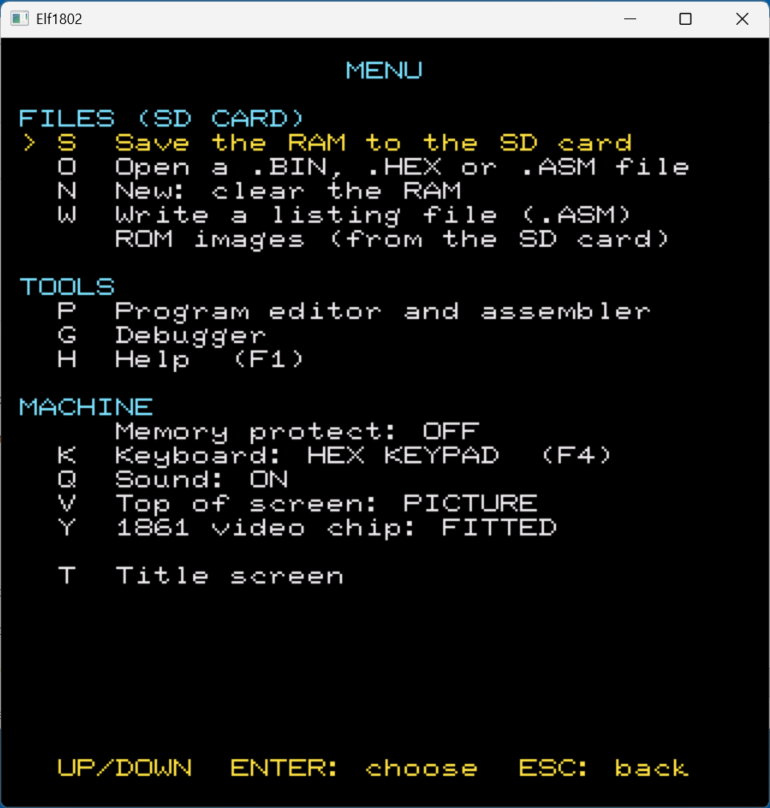
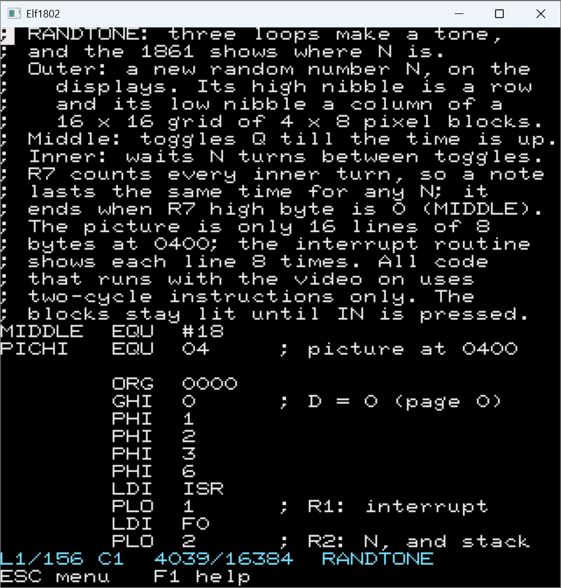
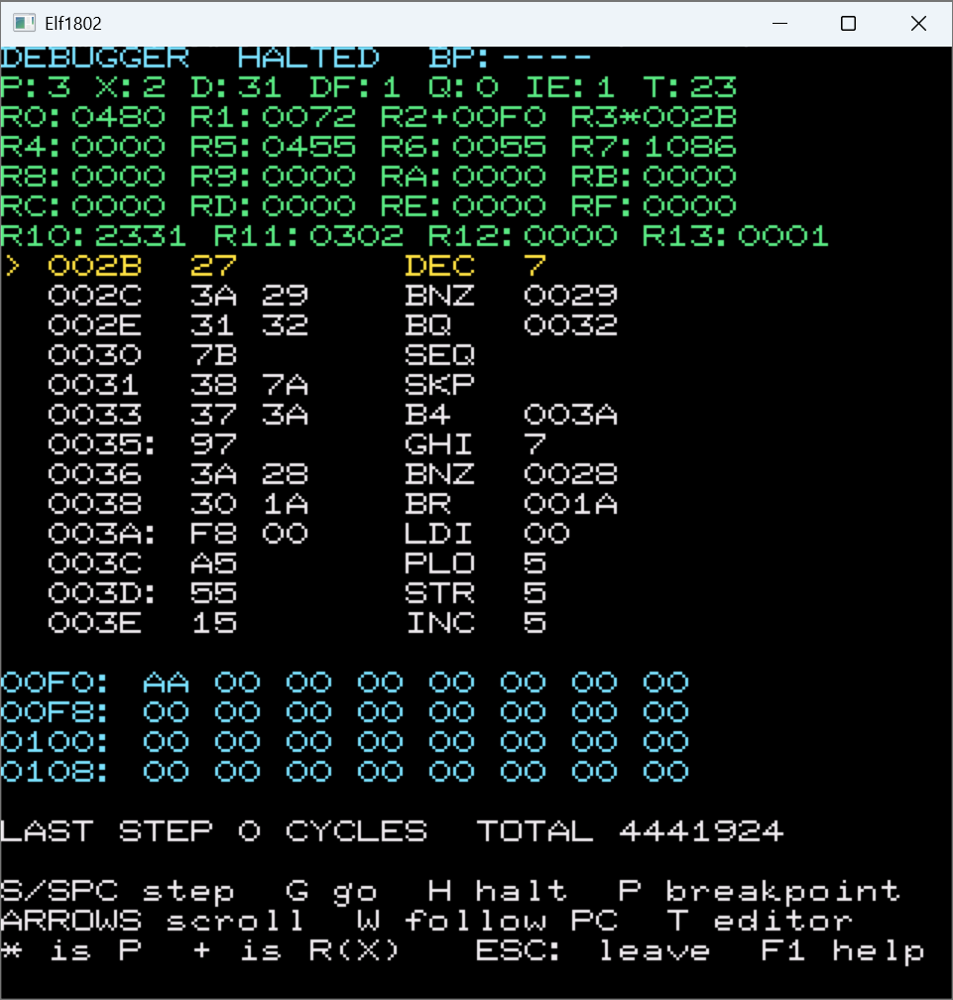

# Elf1802

*README.MD file mostly generated by Anthropic's Claude AI because Thomas Dzubin hates documenting code.  LOL*

Author: Thomas Dzubin    License: MIT    Version: see `VERSION` in
[`elf1802_const.h`](elf1802_const.h)

A **COSMAC Elf** for the ClockworkPi **PicoCalc** (Raspberry Pi Pico or Pico 2),
also buildable for Windows and Linux: an RCA **CDP1802** microprocessor with 16K
of RAM, a hexadecimal keypad, two hex displays, the Q LED, and the **CDP1861
"Pixie"** video chip, whose picture fills the top of the screen. The aim is to
run original Elf programs from the 1970s and 1980s, so every instruction is
emulated and the machine is stepped one machine cycle at a time, with the 1861
kept in step to the cycle.

*Status: working. The emulator is tested on a PC (about 4,000 checks, see
"Testing the emulator" below) and the PicoCalc builds for the Pico 2 (RP2350) and
the Pico (RP2040) both run on the hardware: the emulation takes about a third of
the Pico 2's processor time and 65 to 80 percent of the Pico's, so both keep up
with a real Elf (the registers screen shows SPEED and EMU). The Windows build
works; the Linux build is written but has not been built or tried yet.*

## Screenshots

These are from the Windows build; the PicoCalc shows the same 320 x 320 screen.

<table>
<tr>
<td width="50%"><br>The Elf II front panel at power-on: the hex keypad, two hex displays, the Q LED, the RUN, LOAD and M/P switches and the IN button. The top half is the 1861 picture (blank until a program draws on it).</td>
<td width="50%"><br>The random-tone program running: RUN is up, the displays show the byte, and the 1861 draws a block where that byte points.</td>
</tr>
<tr>
<td width="50%"><br>The <code>ESC</code> menu reaches everything else: files on the SD card, the editor, the debugger, help, memory protect, keyboard, sound, picture or VDU, and the 1861.</td>
<td width="50%"><br>The editor and assembler, here with the source of the random-tone program.</td>
</tr>
<tr>
<td width="50%"><br>The debugger: the registers, a listing from the PC with branch targets marked, a dump of memory, and single-step and breakpoint keys.</td>
<td width="50%"></td>
</tr>
</table>

## What is emulated

- **CDP1802**: all 256 opcodes (the 1802's 91 instructions; 68 acts as INP 0),
  the registers, the interrupt, DMA-IN and DMA-OUT, IDL, and the four control
  modes (LOAD, RESET, PAUSE, RUN). Each call runs one 8-clock machine cycle and
  says whether it was a fetch, execute, DMA or interrupt cycle. Long branches,
  long skips and NOP take three cycles, everything else two.
- **CDP1861**: 14 cycles a line, 262 lines a frame; an interrupt before the
  picture, 8 DMA cycles on each of 128 lines, and the EFX flag on EF1. Where a
  DMA byte lands depends on which cycle it arrived in, so a program that is a
  cycle out of step shows the same shifted picture it would have on a real Elf.
  INP 1 turns the display on, OUT 1 turns it off.
- **The Elf II board**: 16K RAM at 0000 to 3FFF, the keypad's two-digit latch
  read by INP 4, the IN button on EF4 (it pulls the pin low; also the DMA-IN
  request in load mode),
  two hex displays on OUT 4, the Q LED, the RUN, LOAD and memory protect
  switches. The clock is 1.79 MHz (the NTSC crystal divided by two), and the
  main loop runs the emulation in step with real time. The registers screen
  shows the speed as a percentage of a real Elf's.
- **An optional 1861**: the menu (`ESC`, then the 1861 row, `Y`) can take the video chip off the
  board, leaving a basic Elf (an 1802, RAM, keypad, displays and Q; see "Saving and
  loading programs" below).
- **An ASCII keyboard** on port 7 with its key-ready flag on EF3: the PicoCalc's
  keyboard types to the program (`F4` switches to it). INP 7 reads the code of
  the last key and it stays there to be read again, as some programs do; the
  next key comes up about 20 ms after the last was taken. This is what Tiny
  BASIC reads.
- **A VDU**: 1K of video RAM at E000 to E3FF, a screen of 32 x 16 cells like a
  Motorola 6847's. A cell with bit 6 clear is a text character (bits 0 to 5, 6847
  style, bit 7 for inverse), a cell with bit 6 set is four blocks (bits 0 to 3,
  colour in bits 4 and 5), which is how the CHIP-8 games for this screen draw
  64 x 32 pixels. The screen takes the top of the PicoCalc's display in place of
  the 1861 picture, and switches by itself (the picture when the 1861 turns on,
  the VDU when its memory is written); `V` (or the menu) flips it by hand.
- **Intel HEX files** open from the menu as well as `.BIN` images.
- **Q** is shown as a LED on the screen and played as sound on the PicoCalc's
  speaker, as the Elf's Q-driven speaker would be: the level of Q on every
  machine cycle is averaged into samples (22,050 a second, `qaudio.c`), so a
  tone, a tune or a program that pulses Q to make speech-like noise is heard as
  it is, not as a guessed pitch. A steady Q is silent. The menu turns the sound off
  and on.
- **A debugger** (menu, `G`): the registers, a disassembly listing from the PC
  (`disasm1802.c`), a dump of memory at the data pointer, single-stepping by
  whole instructions and one breakpoint. The Elf stops while it is open.

See [`docs/RESEARCH.md`](docs/RESEARCH.md) for the sources, the timing figures
used, the choices made where the documents are silent, and the list of facts
that still need checking against a real program.

## The screen

The top half always shows the 1861 picture (64 x 128 pixels, drawn 5 wide and 1
tall) or the 32 x 16 VDU. The bottom half is one of two screens, and **`TAB`**
switches between them.

**The panel (the default)** is drawn like the front of a Netronics Elf II: the
ELF1802 title with the two red hex displays and, under them, the Q LED, all centred
in the left column, the 4 x 4 hex keypad
in the middle, and the RUN, LOAD and M/P toggle switches with the IN button on the
right. It moves as you press the PicoCalc keys: a hex key (or IN) turns black with a
white frame while its key is held, and a toggle flips up (green; yellow for memory
protect) or down. While the keys go to the ASCII keyboard (`F4`) a yellow
tag reading ASCII over F4=OFF shows under the Q LED, so it always says how to get out, and when a program is
waiting for that keyboard (it tests flag EF3 or reads port 7) while the keys still go to the hex keypad, a
pill that reads KBD? over F4 pulses slowly there to suggest pressing `F4`. The first
letter of each switch name (R, L and M) is underlined, because that is the
key that flips it, and "MENU:ESC" under the Q LED reminds you that `ESC` opens the menu, which reaches
everything else.

**The details** are the registers, the speed read-out and the key help, as text:

```
+------------------------------------------+
|  the 1861 picture, 64 x 128 pixels,      |  320 x 128, each pixel 5 wide
|  drawn 5 pixels wide and 1 tall          |  (or the 32 x 16 VDU, 256 x 160)
+------------------------------------------+
  ELF1802  RCA 1802 + 1861 + VDU, 16K RAM
   [ 4 ][ 2 ]   [Q]          RUN  [R] UP
     DATA                    LOAD [L] DOWN
                             MP   [M] OFF
                             KEYS 42  IN UP
                             MODE RUN
  P:3 X:2 D:5A DF:1 Q:0 IE:1
  R0:0401 R1:0020 R2:00FF R3:0017
  PC:0017 I:3 0  EMU: 31%  SPEED:100%
```

`F1` (or `H`, or `?`) shows a help screen that lists every control key.

## Controls

The keypad screen is the primary one: the hex keypad, the switches and IN are letters and digits, and everything
else is reached from the menu (`ESC`). Only the unshifted function keys `F1` to `F5` are used.

| Key | Does |
|---|---|
| `0`-`9`, `A`-`F` | the hex keypad; the last two digits typed are kept |
| `I` or `ENTER` | the IN button (it pulls EF4 low while it is held) |
| `R` | flip the RUN switch |
| `L` | flip the LOAD switch |
| `M` | flip memory protect (nothing can write the RAM while it is on) |
| `V` | show the VDU or the 1861 picture by hand |
| `TAB` | switch the bottom half between the **panel** and the **details** |
| `F1`, `H` or `?` | the **help screen**: every control key (`H` and `?` are typed to the program in ASCII mode, so use `F1` there) |
| `F4` | switch between the hex keypad and the **ASCII keyboard**, the same key both ways. In ASCII mode every key (`R`, `L`, `M`, `I`, `V` and `H` too) is typed to the program (letters go out as capitals, `ENTER` as CR, `BACKSPACE` as 08), so the switches and IN are not available there; a tag under the Q LED says `F4=OFF` |
| `F5` | sends ESC (1B) to the program from the ASCII keyboard |
| `ESC` | **the menu**, the way to everything else (below) |
| `~` (SHIFT + backtick) | reboots into BOOTSEL (USB drive) mode, from anywhere |
| any key / `ESC` or `Q` | on the title screen: start (the Elf is as you left it) / leave for the UF2 Loader |
| `B` | on the title screen: start the Elf afresh with the random-tone program in memory (so `ESC`, `T`, `B` brings it back, but anything unsaved is lost) |

**The menu (`ESC`)** is a list that you move through with `UP` and `DOWN` and choose from with `ENTER`;
`ESC` goes back. A row with a letter can also be chosen by pressing it (the letters are never keypad keys):

| Group | Rows |
|---|---|
| FILES (SD CARD) | `S` save the RAM to the SD card, `O` open a `.BIN`, `.HEX` or `.ASM` file, `N` new (clear the RAM), `W` write a listing file (`.ASM`), ROM images (the `.ROM` files on the card) |
| TOOLS | `P` the program editor and assembler, `G` the debugger, `H` help |
| MACHINE | memory protect (on or off), `K` the keyboard (hex keypad or ASCII, `F4` too), `Q` sound on or off, `V` the VDU or the picture on top, `Y` the 1861 video chip (fitted or not) |
| last | `T` the title screen |

The editor and the debugger have the same kind of menu or hint row, and `F1` shows the help for the screen you are on.

The switches work as on the Netronics Elf II:

| RUN | LOAD | Mode |
|---|---|---|
| down | down | **RESET**: the CPU is held; R0 is cleared when it ends |
| down | up | **LOAD**: type two hex digits, press `I`; the byte goes to RAM at R0, which steps on |
| up | down | **RUN**: the program runs from address 0000 |
| up | up | **PAUSE**: the CPU stops where it is |

To enter a program: flip `L` and `R` until the mode reads LOAD (from a reset:
`L` alone), then type each byte as two digits and press `I`. Flip `L` down
(RESET), then `R` up (RUN).

## The editor and assembler (ESC, E)

Typing programs as hex digits gets old, so the menu has a small **text editor with
an assembler**. It runs on the PicoCalc itself (not inside the emulated Elf) and
keeps your text between visits. `ESC`, `P` opens it (it is in the TOOLS group of the menu); `F1` in the editor shows its help.

In the text: the arrow keys, `HOME`, `END`, `PAGE UP` and `PAGE DOWN` move; `ENTER`
starts a new line with the same indent; `BACKSPACE` and `DEL` delete; `TAB` goes to
the next multiple of 8. `ESC` opens the editor's menu, which works like the Elf's (`UP`, `DOWN`, `ENTER`, or the
letter where a row has one, `ESC` to go back):

| Row | Does |
|---|---|
| `P` put the program in the RAM | **assemble** into the Elf's RAM (the machine is left in RESET, ready to run). If there are errors the lines are drawn in red, the first is named at the bottom, and nothing is loaded |
| `G` go | assemble, load, and **run** it: back on the Elf screen with RUN up |
| debug | assemble, load, and open the **debugger** on it, stopped at the first instruction |
| listing and labels | the **listing** (address, bytes and source of every line); `TAB` swaps it for the **labels** and their values |
| next error | go to the next line with an error |
| `S` / `O` | save / open the source as `/ELF1802/NAME.ASM` on the SD card |
| `N` | new text |
| disassemble | **disassemble** the Elf's RAM into the editor (with `L0123:` labels on every branch target), so a program entered by hand or loaded from a file can be read and changed |
| `X` | leave the editor |

The text can be up to 16,384 characters and 1,536 lines.

**Opening a program from the menu (`ESC`, `O`) also puts its source in the editor.** The
whole RAM is disassembled, with a label such as `L001A` (the hex address) on every
address that a branch or jump goes to, and named after the file (a save then writes
`NAME.ASM`). It replaces whatever text the editor held, so save that first if you want
it. A program whose listing is more than 16 KB does not fit the text, so the
listing stops where the room ran out and the editor says where ("LISTING STOPS AT 04E0").
What is there always assembles with no errors to the same bytes: a jump to an address that
has no line in the text (past the end of the listing, or into the middle of an instruction)
is written with the hex address instead of a label. Because the text is only the start of the
program, `A` (assemble) then changes only the bytes it makes and keeps the rest of the RAM.

**Code and data are told apart.** The listing follows the program from address 0000 through its
branches and jumps (and into the addresses that it loads into a register that a `SEP` uses, and
into R1, the interrupt's), and writes what it reaches as instructions. What it does not reach is
data: it is written as `DB` lines of eight bytes, `DB "TEXT"` for printable text of five
characters or more, and `DS n` for a run of eight zero bytes or more. Tables and messages
then take a line for every eight bytes rather than a line of nonsense instructions for every
byte, so far more of a program fits the text. The listing always assembles to exactly the
same bytes. The trace cannot see code that is only reached by a computed address (a jump table, or a
register loaded from memory); that shows as `DB` lines, not as instructions.

The listing also adds a short note after the instructions that talk to the Elf's own
parts, so a program is easier to read: `OUT 4` is "hex displays", `INP 4` "hex keypad",
`INP 1` "1861 video on", `OUT 1` "1861 video off", `INP 7` "ASCII keyboard", `SEQ` "Q on" and
`REQ` "Q off", `B4` / `BN4` "if IN pressed" / "if IN not pressed", `B3` / `BN3` "if key
waiting" / "if no key waiting" and `B1` / `BN1` "if 1861 EFX low" / "if 1861 EFX high". The
notes are comments, so they do not change the program, and the table is `ASM_NOTES` in
`isa_1802_const.h`.

**`ESC`, `W` writes the whole RAM as a listing to a `.ASM` file** on the SD card, with no limit on its
length (it is written a piece at a time, not through the editor's text). It asks for a name, which
starts as the program last saved or opened, and writes `NAME.ASM` to the `ELF1802` folder.
Opening that file again (`ESC`, `O`) assembles it back into the same program.
The editor starts with the source of the random-tone program that is in memory at
power-on (named `RANDTONE`, also in `programs/RANDTONE.ASM`), as an example to
read, change and assemble. `B` on the title screen brings it back, along with the
program itself.

### Assembly syntax

```
        ORG   0000          ; where the code goes (default 0000)
START:  LDI   #47           ; label, instruction, operand, comment
        PLO   5             ; register 5 (R5 means the same)
LOOP:   GLO   5
        BNZ   LOOP
        LBR   START
TABLE:  DB    01, 02, "HI", 0 ; bytes and text
        DW    TABLE+2       ; 16-bit words, high byte first
        DS    10            ; reserve (zero) bytes
PORT    EQU   4             ; a named value
        END
```

- Instructions are spelled as the debugger shows them (RCA's names: `IDL`, `LDN`,
  `INC`, `GLO`, `SEP`, `SEX`, `OUT`, `INP`, `BR`, `LBR`, `BN1`, `B4` and so on),
  in any case. `NBR`, `NLBR`, `RSHR` and `RSHL` are accepted too, for `SKP`,
  `LSKP`, `SHRC` and `SHLC`.
- **Numbers are hexadecimal.** A leading `#` makes one decimal (`#47`); `$2F`,
  `0x2F` and `2FH` are hex too; `'A'` is a character. `*` is the address of the
  line. `+` and `-` combine values, and a leading `<` or `>` takes the low or
  high byte (`LDI <TABLE`, then `LDI >TABLE`).
- A register is `R5` or just `5`. A name made with `EQU` works as a register or
  port number too.
- A label ends in a colon and can be up to 12 letters, digits and underscores. A
  name that could be read as a hex number (`ADD`, `BEEF`) or as a register
  (`R5`) cannot be a label. Labels may be used before they are defined.
- A short branch (`BR`, `BZ`, `B1` ...) can only reach the page it is on: the
  target must be on the same 256-byte page as its operand byte, and the
  assembler says so if it is not. Use `LBR` and the other long branches to cross
  a page.
- Bytes may not overlap, and the code has to fit the 16K of RAM.

## The debugger (ESC menu, `G`)

`ESC`, `G` stops the Elf and shows its insides; `ESC` goes back and lets it run. `F1` shows the help.

```
DEBUGGER  HALTED  BP:0014
P:3 X:2 D:2F DF:0 Q:0 IE:1 T:00
R0:0000 R1:0000 R2:0000 R3*0004
...
> 0004: F8 2F    LDI  2F        > marks the PC; the colon marks a branch target
 *0006  A5       PLO  5         * marks the breakpoint
```

| Key | Does |
|---|---|
| `S` or `SPACE` | run **one whole instruction** (with the DMA or interrupt cycles that come before it) and show what it did |
| `G` | run on, until the breakpoint if there is one |
| `H` | halt, at the end of the instruction the CPU is in |
| `P` | set (or clear) the breakpoint on the **top line** of the listing |
| arrow keys | scroll the listing: up one byte, down one instruction, left and right 16 bytes |
| `W` | the listing follows the PC again |
| `T` | the text editor (the debugger stays where it was; the editor can run or debug what it assembles) |
| `0`-`9` `A`-`F`, `I`, `R` `L` `M` | still work (the hex keypad, IN and the switches) |

In the listing a colon after an address (`0012:`) marks an instruction that some
branch or jump goes to, so loops and subroutines stand out. It is found by decoding
the used part of RAM from address 0, so data mixed in with the code can add a stray
colon. A `>` in front marks the PC and a `*` the breakpoint.

In the register rows `*` marks the register that is the program counter (P) and
`+` the data pointer (X); `#` means both are the same register. The bottom of the
screen shows the cycles the last step took (a two-cycle instruction shows 2, a
long branch 3) and the total since reset. The dump is eight bytes a line from
R(X). Stopping is always at the end of an instruction, so what you see is a whole
number of instructions. The 1861 picture is frozen while stopped.

## Saving and loading programs

`ESC` opens the menu. **Save** asks for a name (letters and digits, up to 8) and
writes the whole 16K RAM to `/ELF1802/NAME.BIN` on the SD card (FAT32). **Open**
lists the `.BIN` and `.HEX` files in that folder (starting on the file you had
highlighted last time); choosing one loads it at
address 0000 (a `.HEX` file at the addresses it gives), fills the rest of RAM
with zeros and puts the machine in RESET, ready to run. A `.BIN` file is a raw
memory image and a `.HEX` file is Intel HEX text (up to about 48 KB), so
programs made on a PC can be copied into the folder; HEX data for addresses
above the 16K RAM (a ROM, say) is left out and counted in the message.

**Open also lists `.ASM` source files** (assembly text, as the editor reads it; see
"The editor and assembler"). Choosing one reads it into the editor in place of the text
there, assembles it, loads the result into the RAM and puts the machine in RESET, ready
to run, the same as opening a `.BIN`. If it has an error, or is too big for the text, you
land in the editor with the cursor on the first error instead. `programs/RANDTONE.ASM` is
the source of the random-tone program: copy it to the `ELF1802` folder to try this. On a PC build the folder is `ELF1802` beside where the
program is run.

The menu also has a row (`Y`) that fits the **1861 video chip** to the board or takes it
off. With it off the Elf is a **basic Elf**, as the first Elfs were before anyone
added video: an 1802, RAM, the keypad, the two displays and the Q LED. EF1 is then
just a free flag pin (high), the chip gives no interrupt or DMA, and `INP 1` and
`OUT 1` do nothing. The top half of the screen then shows the CPU's registers, the
next instruction and the cycle count instead of a picture. The 1861 is fitted again
each time the Elf is powered on (`B` on the title screen).

### ROM images

`ESC`, ROM images fits up to two **ROM images** to the Elf's memory, over whatever is at those addresses (the
memory protect switch does not matter to them; a write to a ROM does nothing). A ROM image is a raw file
ending in `.ROM` in the `ELF1802` folder of the SD card, up to 16 KB. Choose a slot with `UP` and `DOWN`, then `ENTER`
to pick the file and give its address in hex (it must end in `00`, since memory is mapped in 256-byte
pages), or `DEL` to take the ROM out. What is fitted is remembered in `ELF1802/ROMS.CFG` (a line for each
slot: `1 MONITOR.ROM C000`) and fitted again whenever the Elf is powered on. The debugger shows a ROM's
bytes like any other memory. The ROM facility belongs to the memory map (`membus.c`) and `rom.c`, not to
the 1802, so any machine added later gets it by calling `rom_apply()` where it maps its memory.

### Demo programs

[`programs/`](programs/) holds three ready-made images to try the machine without
typing in hex: copy them into an `ELF1802` folder on the SD card, then use
`ESC`, **Open**, and flip `R` to run.

- **`PIXIE.BIN`**: a test picture on the 1861 (a frame and two diagonals,
  64 x 128 pixels), using the standard Elf video routine: an interrupt routine
  that sets R0 and burns exactly 29 cycles, and a main program of two-cycle
  instructions only.
- **`QTONE.BIN`**: toggles Q at about 440 Hz, so the Q LED flickers and the
  speaker plays the tone (you can watch it work in the debugger).
- **`RANDTONE.BIN`**: a small program (131 bytes) made of three loops, that also uses the
  1861. The outer loop makes a number N (shown on the two hex displays) with `ADC` and
  `ADD`, which visit all 256 values before repeating, and lights a block of 4 x 8 pixels
  on the picture: N's high nibble is the row and its low nibble the column of a 16 x 16
  grid (the picture is only 16 lines of 8 bytes at 0400, and the interrupt routine shows
  each line 8 times, which makes the blocks 4 x 8 pixels). The middle loop toggles Q until the time is up; the inner loop waits N turns
  between toggles (256 for N = 00), so a bigger N is a lower pitch. The inner loop also
  takes one off the 16-bit register R7 on every turn, and a note ends when R7's high
  byte reaches 0, so the notes last about the same time whatever N is (about a quarter
  second; only the very smallest N, where the toggling itself takes most of the time,
  run longer). The blocks stay lit, so the picture fills up as the notes play;
  pressing the IN button (the `I` key) clears the whole picture (the program tests EF4 on
  every toggle of Q and zeroes the 128 bytes at 0400), and it starts filling again. Its source is `RANDTONE.ASM`; `MIDDLE` (01 to 7F,
  one step is 256 turns of the inner loop) is the one number to change to make the notes
  shorter or longer. Notes: the interrupt routine runs for the whole picture (rewinding R0 between
  the DMA bursts), so the main program gets about half of the CPU's cycles and the tone
  has the 60 Hz warble that Elfs with video really had;
  the program is made only of two-cycle instructions (the Q toggle uses `BQ`, `SEQ`, a
  `38` that skips the next byte, `REQ`) so the 1861 picture stays steady; the interrupt
  routine saves T and D and sets R0 exactly 29 cycles after the interrupt. The picture is not cleared by RESET, only by the IN button. **This is the program already in memory when the Elf starts**, so just
  press `R` to hear it and see it (memory protect off). The same image is in the folder
  to load again after opening something else.

`make_programs.c` writes all three (see its header); it is plain C and uses the project's
assembler for RANDTONE.

[`programs/emma02/`](programs/emma02/) holds 67 more images from
the Emma 02 emulator's software collection: Pixie games (Breakout, Dog Fight, Blockade,
Miniature Golf, Pinball, Star Trek, Space Invaders and others), the famous
Enterprise program from the 1977 Popular Electronics article (SPCSHIP), 13 VDU games (Wumpus, Lunar Lander, Bowling and others), two
Tiny BASICs (typed on the ASCII keyboard), demos, tiny tunes and 18 Christmas
carols played through Q. See its
[`CATALOG.md`](programs/emma02/CATALOG.md) for the keys, what was checked and
what was left out. They are other people's work, included here as abandonware: the
copyrights stay with the original authors and they are not covered by this project's
licence. If you wrote one and want it taken out, please open an issue and it will be removed.

## Programming the Elf: ports, flags and memory

What a program can reach, as this Elf has it. The hex keypad and the two displays
share **port 4**: that pair is how an Elf program talks to the person at the panel.

| | Instruction | What it does |
|---|---|---|
| **Keypad in** | `INP 4` (`6C`) | the byte in the keypad latch goes to M(R(X)) and to D |
| **Displays out** | `OUT 4` (`64`) | the byte at M(R(X)) is shown on the two hex displays, then R(X) goes up by one |
| Video on | `INP 1` (`69`) | turns the 1861 on (the byte read is not meaningful) |
| Video off | `OUT 1` (`61`) | turns the 1861 off (R(X) goes up by one as usual) |
| ASCII keyboard | `INP 7` (`6F`) | the code of the last key typed (see below) |
| Q line | `SEQ` (`7B`), `REQ` (`7A`) | Q on or off: the LED, and the speaker |

**The keypad (`INP 4`).** The keypad keeps the last **two** hex digits typed, as a
byte: type `3` then `A` and the latch holds `3A` (the older digit is the high
nibble). It keeps that value until more digits are typed, so a program can read it
as often as it likes, and it reads `00` before anything has been typed. There is no
"key pressed" strobe on the hex keypad, so a program that wants to wait for a key
waits for the **IN button** instead, which pulls flag **EF4** low while it is held:
`B4` (branch if EF4) is taken while IN is pressed and `BN4` while it is not.

**The displays (`OUT 4`).** Two hex digits, high nibble on the left. They hold the
last byte written, so a program writes a value once and it stays on view. They show
data only: the Elf has no address display. In LOAD mode they also follow the digits
you type and show each byte that IN stores. Nothing is read back from them.

**`OUT` and `INP` use R(X).** Both work on the memory byte that the X register
points at: `INP` stores the port's byte there and leaves R(X) alone, `OUT` reads
the byte there and then adds one to R(X). To show a value in D, store it first,
output it, and put R(X) back:

```
    STR 4          ; 54   M(R4) = D
    OUT 4          ; 64   show M(R4) on the displays   (X must be 4, R4 goes up by one)
    DEC 4          ; 24   R4 is where it was
```

A complete small program that copies the keypad to the displays (type digits and
watch them appear; run with `R`, memory protect off):

```
0000  F8 00        LDI 00
0002  B2           PHI 2
0003  F8 40        LDI 40
0005  A2           PLO 2         R2 = 0040, a byte to use
0006  E2           SEX 2         X = 2
0007  6C           INP 4         the keypad latch to M(R2) and D
0008  64           OUT 4         M(R2) to the displays (R2 = 0041)
0009  22           DEC 2         R2 = 0040
000A  30 07        BR 0007
```

**Flags.** The EF pins are *true when low*, so `B1` to `B4` branch when the pin is
low and `BN1` to `BN4` when it is high. EF1 is the 1861's EFX line, EF3 is the ASCII
keyboard's strobe (low while a key waits) and EF4 is the IN button. EF2 is unused
and reads high.

**The ASCII keyboard (`INP 7`).** It holds the code of the last key typed in a
latch that can be read again and again; EF3 goes low when a new key arrives and high
once `INP 7` has taken it, and the next waiting key shows about 20 ms later. Use
`F4` on the PicoCalc to send the keys to it.

**Memory.** RAM is 0000 to 3FFF. The VDU's video RAM is at E000 to E3FF (32 x 16
cells; see `elf_const.h` for the cell format). Reads from anywhere else give 00 and
writes are ignored. Memory protect stops writes to the RAM (not to the VDU).

**Reset and the modes.** RESET clears I, N and Q, sets IE, turns the 1861 off, and
the next start has X = P = 0 and R0 = 0. An `INP` or `OUT` with any other port number
than those above reads `00` or is ignored.

The ports and flags are the standard ones for an Elf and for the programs written
for it; `programs/RANDTONE.BIN` (see `make_programs.c`) is a worked example that uses
`OUT 4` for the displays.

## Files

```
elf1802.c                 the PicoCalc side of the Elf itself: running the machine, the Elf II panel and
                          details screens, the picture and VDU, the keys, the sound
elf1802_const.h           its constants: version, colours, screen positions, keys, 7-segment tables
ui.c / ui.h               text and keyboard helpers shared by every screen (ui_const.h: their constants)
title.c / title.h         the title screen (title_const.h)
filemenu.c / filemenu.h   the menu: save, open (.BIN / .HEX), clear RAM, leave (filemenu_const.h)
editor.c / editor.h       the text editor and assembler screens: editing, listing, labels, .ASM files
                          (editor_const.h)
isa.h / isa_const.h       what the tools need to know about a processor: how to write an instruction,
                          where the program goes next, its number spelling, how to assemble a line
isa_1802.c / isa_1802.h   the CDP1802 for those tools (isa_1802_const.h)
asm_core.c / asm_core.h   the assembler for any processor: lines, labels, expressions, directives, two
                          passes (portable C; asm_const.h)
source_gen.c / source_gen.h  source text from a program's bytes for any processor: the code/data trace,
                          the listing, the file written by D (portable C)
tests/test_isa.c          checks of the 1802's description: every opcode reads back from its own
                          disassembly, known programs assemble to known bytes, the listing of random
                          bytes assembles back to them
othercpus/                everything that is not the Elf: other processors (6502, 8080, Z80, 6800,
                          6803, 6809), the MC6803 and Z80 cores, the MC6847 video chip and the TRS-80
                          MC-10, with their tests and notes. Not part of any build (othercpus/README.md)
helpscreen.c / .h         the help screen listing every control key (helpscreen_const.h)
debugger.c / debugger.h   the debugger view: registers, disassembly, memory, single-step, breakpoint
                          (debugger_const.h)
picture.c / picture.h     the 1861's picture on the screen (picture_const.h)
vdu.c / vdu.h             the VDU on the screen (vdu_const.h)
regview.c / regview.h     the register read-out that fills the top of the screen when there is no 1861
                          (regview_const.h)
cpu1802.c / cpu1802.h     the CDP1802: instruction set and machine-cycle sequencing (portable C)
cdp1861.c / cdp1861.h     the CDP1861 video chip (portable C)
elf.c / elf.h             the Elf board: RAM, ports, keypad, ASCII keyboard, VDU RAM, switches (portable C)
machine.h                 what the shell needs of a machine: its name, its clock, how to run some cycles
target.c / target.h       the program memory as the editor and the file menu see it: the RAM, the processor
                          (isa_t), what to do when a program is loaded, a menu line of the machine's own
elfpanel.c / elfpanel.h   the Elf II front panel on the screen (told what to show; draws what changed)
rom.c / rom.h             ROM images: up to two files fitted over any machine's memory map, remembered in
                          ELF1802/ROMS.CFG (rom_const.h)
membus.c / membus.h       the memory map any machine uses: 64K in 256-byte pages of RAM, ROM, a device or
                          nothing, with write protect (portable C; membus_const.h)
hexfile.c / hexfile.h     Intel HEX loading (portable C)
qaudio.c / qaudio.h       Q as sound: samples of the Q line, a DC blocker, a FIFO (portable C)
disasm1802.c / .h         the 1802 disassembler for the debugger (portable C); disasm_const.h has its tables
elf_const.h               constants of the emulated machine: clock, modes, ports, 1861 timing
platform.h                the interface to the machine: clocks, sleep, sound, saved programs, BOOTSEL, loader exit
platform_const.h          constants shared by platform.h and its implementations
platform_pico.c           platform.h on the Pico SDK (clock, sound by PWM and DMA, SD card through FAT32)
platform_pico_const.h     constants for platform_pico.c: the UF2 Loader hand-off values, the sound pins
CMakeLists.txt            builds the firmware, reusing picocalc-text-starter-main/drivers/*
tests/test_emulator.c     checks the CPU, the 1861 timing and the board on a PC (no hardware)
programs/                 demo programs (PIXIE.BIN, QTONE.BIN, RANDTONE.BIN) and make_programs.c that writes them
boot_program.h            the RANDTONE image as C (written by make_programs.c); it is in memory at power-on
boot_source.h             its assembly source as C (also written by make_programs.c); the editor starts with it
docs/RESEARCH.md          the research behind it: sources, timings, open questions
tools/                    helper programs used to build and check the demo images (see their headers)
desktop/                  Desktop (SDL2) build, Windows and Linux: CMakeLists.txt, shim_desktop.cmake
                          (shared build logic), the small shim that stands in for the PicoCalc
                          drivers, and platform_desktop.c
pico_sdk_import.cmake     standard Pico SDK locator
picocalc-text-starter-main/ vendored driver layer (see License; do not edit)
LICENSE, CHANGELOG.md     MIT licence; version history
```

## Building

### With the Raspberry Pi Pico VS Code extension (easiest)

Open this folder, pick the board (Pico or Pico 2) and press Compile.

### From a terminal

Set `PICO_SDK_PATH` to your Pico SDK checkout (SDK 2.2.0), then:

```bash
cmake -B build-rp2350 -G Ninja -DPICO_BOARD=pico2
ninja -C build-rp2350
```

For a Pico or Pico W use `-DPICO_BOARD=pico` or `-DPICO_BOARD=pico_w`. The
result is **`elf1802-RP2350.uf2`** (or `-RP2040.uf2`), also copied to this
folder.

An option, `-DCOPY_TO_RAM=ON`, builds a version that copies the whole program to
RAM when it starts (named `elf1802-<chip>-ram.uf2`). On the Pico 2 it made no
measurable difference, so it is off by default.

### On Windows

A small SDL2 layer in [`desktop/`](desktop/) stands in for the PicoCalc's LCD and
keyboard drivers (the sound goes straight to SDL, from `platform_desktop.c`).
From an MSYS2 UCRT64 shell with SDL2 installed:

```bash
cmake -S desktop -B build-windows -G Ninja
ninja -C build-windows
```

The result is **`elf1802-Windows.exe`** in this folder (SDL2 is linked
statically, so it is a single file). The PC keyboard takes the place of the
PicoCalc's, and `~` closes the program.

### Linux

With the SDL2 development package installed (for example `libsdl2-dev`):

```bash
cmake -S desktop -B build-linux
cmake --build build-linux
```

The result is **`elf1802-Linux`** plus **`libSDL2-2.0.so.0`** in this folder.
Keep the two files together; the executable finds the library beside itself.

### Testing the emulator on a PC

The emulator files need no PicoCalc parts, so the tests build with any C
compiler:

```bash
gcc -Wall -Wextra -I. tests/test_emulator.c cpu1802.c cdp1861.c elf.c membus.c target.c rom.c hexfile.c qaudio.c disasm1802.c asm_core.c isa_1802.c source_gen.c -o test_emulator
./test_emulator
```

The 1802's description for the assembler, the listing and the disassembly has its own test:

```bash
gcc -Wall -Wextra -I. tests/test_isa.c asm_core.c source_gen.c isa_1802.c disasm1802.c -o test_isa
./test_isa
```

They check the arithmetic and logic, the registers and memory, every branch
and skip, the stack and I/O instructions, that all 256 opcodes run in the right
number of machine cycles, interrupt and DMA sequencing, IDL, reset and load
mode, the front panel, the ASCII keyboard (and a program asking for it), the
VDU's memory, Intel HEX loading (including bad checksums and data above the RAM),
a stored picture coming out of the 1861 byte for byte, the Q line as sound (the
sample count, the pitch, silence for a steady Q), single-stepping and breakpoints,
the disassembler and its branch targets, the board without an 1861, the
random-tone program in memory at power-on, and the port 4 example above.

## Other processors

The tools are written to work for any processor. A processor is described by one `isa_t` (see `isa.h`):
how to write an instruction as text and which way the program goes after it (for the disassembler and the
code/data trace of the listing), how its numbers are spelled, and how to turn one line of assembly into
bytes (using the assembler's `asm_*` helpers for the operands). `isa_1802.c` is the one in use. The assembler
works in a window of the machine's address space that it is given (`asm_assemble(isa, asm, base, size, ...)`;
the buffer is `ASM_IMAGE_SIZE`, 16 KB, the Elf's RAM).

Work on other processors and machines (the 6502, 8080, Z80, 6800, 6803 and 6809 descriptions, the MC6803 and
Z80 cores, the MC6847 video chip, the TRS-80 MC-10) is kept apart in the `othercpus/` folder. None of it is in the
firmware or desktop builds and nothing in the Elf calls it; see `othercpus/README.md`.

## Flashing

Hold BOOTSEL while powering the PicoCalc on, or press `~` in the program. A
drive named `RPI-RP2` appears; copy the `.uf2` file onto it.

## License

This project's own code and docs (`elf1802.c`, the emulator files, the build
files, this `README.md`) are released under the MIT License, see
[`LICENSE`](LICENSE). Copyright © 2026 Thomas Dzubin.

### Third-party

`picocalc-text-starter-main/` is a vendored copy of
[**picocalc-text-starter**](https://github.com/BlairLeduc/picocalc-text-starter)
by Blair Leduc (the LCD, south-bridge keyboard, SD card and FAT32
drivers). It is **not** relicensed by this project: it keeps its own MIT license
at [`picocalc-text-starter-main/LICENSE`](picocalc-text-starter-main/LICENSE),
Copyright © 2025 Blair Leduc. The Raspberry Pi Pico SDK it builds against is
licensed separately by Raspberry Pi Ltd. (BSD-3-Clause).

The vendored copy is unchanged except for **one small fix** in
`picocalc-text-starter-main/drivers/fat32.c`: `get_next_free_cluster()` now
advances its search hint past the cluster it just handed out; without that,
every later allocation re-scans the clusters already given out, and a long
sequential write to the SD card looks hung. Everything else is exactly as
downloaded.

The vendored `lcd_putstr()` does not stop at the right edge of the screen, so
every string this program draws is cut to fit the 40-column text grid before
it is passed to it.
